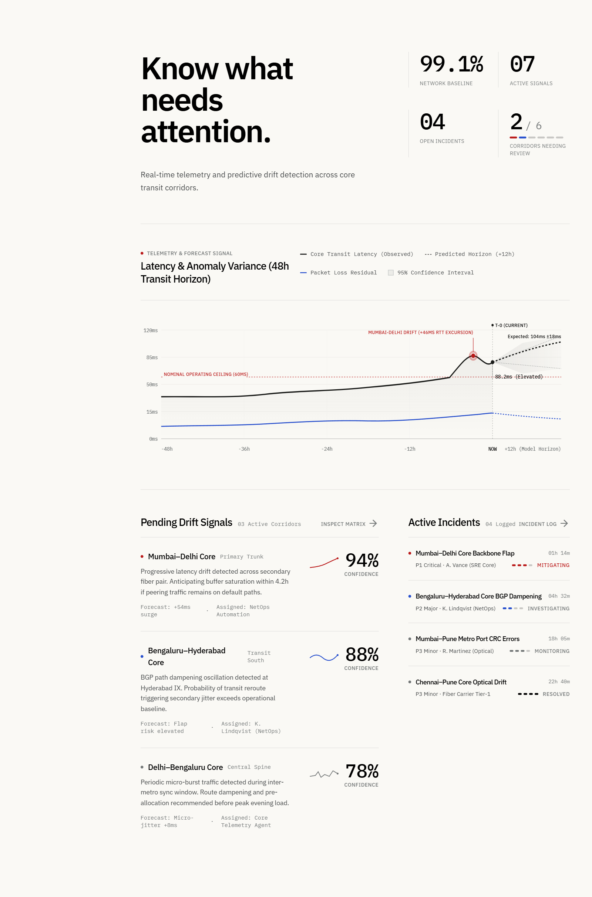
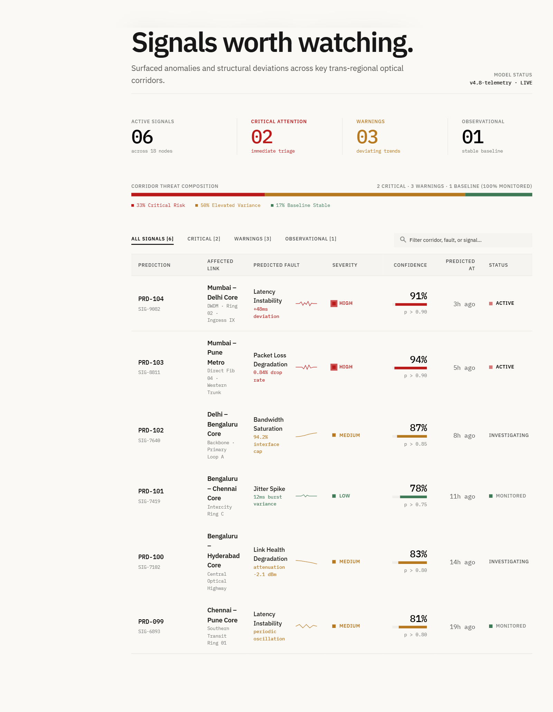
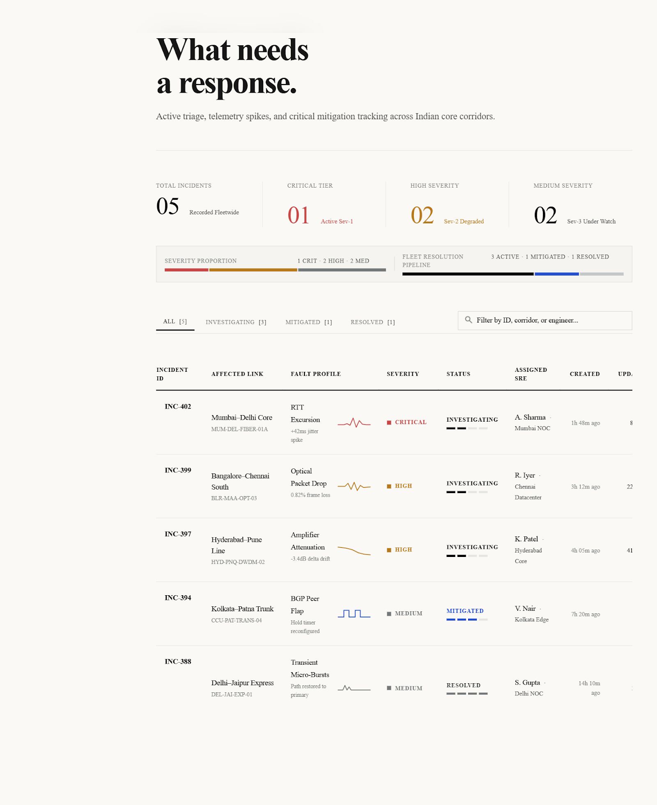
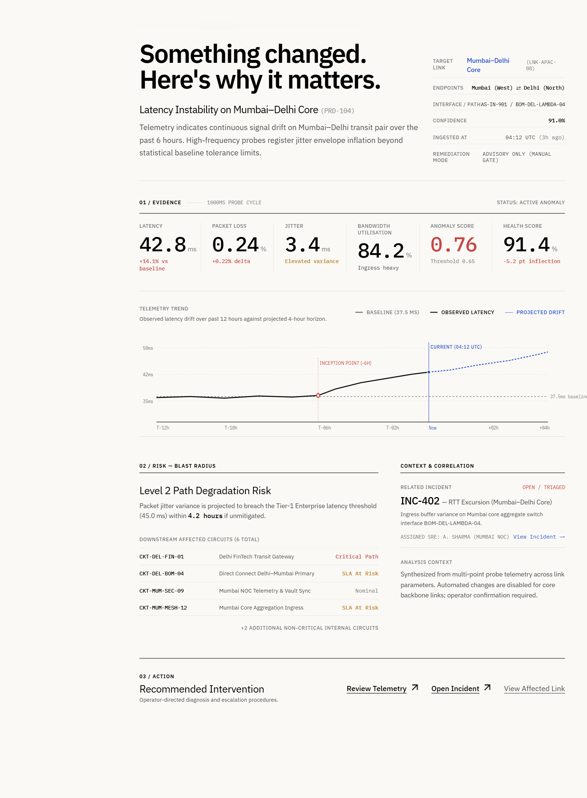

# NetSense AI

Predictive network monitoring and incident investigation — a working product prototype.

NetSense turns raw link telemetry into a workflow an operator can actually act on: it flags which corridors are drifting from baseline, surfaces the predictive signal and evidence behind that flag, links it to any incident it produced, and shows who is investigating it — all in one connected, explorable product instead of a wall of static charts.

Built during a Product Management internship at Tata Teleservices Ltd.

## Live Demo

**[https://netsense-ai-bclu.vercel.app/](https://netsense-ai-bclu.vercel.app/)**

## Product Truth

This is a portfolio prototype, not a production system. To be specific about what that means:

- Telemetry is synthetic — generated by a seeded, deterministic model, not collected from real hardware.
- Anomaly, health, and risk scoring are rule-based (weighted deviation from a per-link baseline), not a trained ML model.
- It is not connected to a production network and has no real customers.
- There is no autonomous remediation. Every workflow ends at an operator decision point, never an automatic infrastructure change.

## Why I Built It

Traditional monitoring tells an operator what is happening *right now*. It rarely explains what changed, why it matters, or what to do next — that context is usually scattered across separate dashboards, ticketing tools, and tribal knowledge.

NetSense is designed around a single question: when a corridor starts to drift, can the product get an operator from *"something's off"* to *"here's the evidence, here's the incident, here's who owns it"* without leaving the screen they're already on?

## Product Workflow

```
Telemetry
  → baseline / deviation analysis
    → anomaly signal
      → severity / confidence assessment
        → prediction
          → incident
            → engineer investigation
              → resolution
```

Every step above is a real, linked record in the product — a prediction always points back to the link it came from and forward to the incident it produced (if any); an incident always points to its originating prediction and its assigned engineer. Nothing here implies autonomous infrastructure changes — the workflow ends at operator investigation and action, by design.

## Key Product Capabilities

- **Network Overview** — fleet-wide health baseline, active signal count, and a 48-hour latency/anomaly trend for an operator-selectable corridor.
- **Network Links** — sortable, filterable table of all corridors with live health/latency/loss/load/jitter, and at-a-glance indicators for any link with an active prediction or open incident.
- **Predictions & Prediction Detail** — severity, confidence, and projected risk horizon for each signal, with the underlying telemetry evidence (latency, loss, jitter, bandwidth) and a horizon curve that reshapes itself from that prediction's actual confidence and time-to-impact.
- **Incidents & Incident Detail** — full incident timeline cross-referenced to its originating prediction and assigned engineer, with timeline entries that move the telemetry chart's crosshair to the corresponding moment.
- **Engineers** — duty roster filterable by region and specialisation, with each engineer's currently assigned incident.
- **Interactive telemetry charts** — hover/touch/keyboard-driven crosshair and tooltip, baseline and threshold overlays, projected-horizon shading.
- **Linked relationships everywhere** — link ↔ prediction ↔ incident ↔ engineer references are real, clickable navigation, not decorative text.
- **Responsive, keyboard-accessible UI** — validated from 375px mobile through 1440px desktop, with keyboard equivalents for every interactive element (sort, filter, chart inspection, evidence/corridor selection).

## Product Thinking

- **Investigation-first, not dashboard-first.** The product is built around following a signal to its evidence and its owner, not just displaying numbers.
- **Evidence before conclusion.** A prediction's confidence is never shown without the telemetry that produced it being one click away.
- **Relationships as a first-class concept.** Link, prediction, incident, and engineer are never siloed screens — every one links to the others because that's how an operator actually thinks about an incident.
- **Progressive disclosure.** List views stay dense and scannable; detail views expand into full evidence and context on demand.
- **Reusable detail patterns over one-off screens.** Engineer Detail wasn't part of the original design source — it's assembled entirely from primitives already established elsewhere in the product (hairline stat rows, editorial captions), so a new route didn't mean a new visual language.
- **Operator control, not simulated autonomy.** The product surfaces evidence and recommends nothing it can't back up; it never pretends to take action on its own.

## Detection Approach

Detection is deterministic and fully inspectable — there is no black box.

For each link, current telemetry is compared against that link's own baseline:

1. **Deviation terms** are computed for latency, packet loss, jitter, and bandwidth utilisation, each normalised to its own "notable excursion" scale and capped at 1 (so a metric with a near-zero baseline, like packet loss, doesn't blow up the score).
2. A **weighted composite anomaly score** (latency 40%, loss 30%, jitter 15%, bandwidth 15%) combines those terms into a single 0–1 figure.
3. A link is flagged for **attention** once its anomaly score crosses a shared threshold (`0.22`) — the same threshold is used everywhere that number is shown, so the product can never show a link as "healthy" in one place and "attention" in another.
4. A **health score** (100 − anomaly score × 38, floored at 55) gives the same information as a single top-line percentage.

Predictions and incidents are authored example signals — severity, confidence, narrative, and evidence values are fixed dataset content representing what a rule engine would plausibly surface, not live model output. What *is* computed live from each record's real fields: the risk-horizon curve on Prediction Detail reshapes its inflection point from that prediction's actual `horizonHours` and `confidencePct`, and every cross-reference between a link, prediction, incident, and engineer is resolved from the same shared dataset at render time — so the numbers stay internally consistent everywhere they appear.

## Technical Architecture

- **React 19 + TypeScript + Vite**, **React Router 7** for client-side routing, **Tailwind CSS v4** (via `@tailwindcss/vite`) for styling.
- **`src/data/`** — the dataset: 6 India network corridors, 7 predictions, 6 incidents, 10 engineers, and a deterministic 48h+12h telemetry generator seeded per link.
- **`src/lib/derive.ts`** — the anomaly/health scoring described above.
- **`src/lib/aggregate.ts`** — cross-references links, predictions, incidents, and engineers so every screen agrees.
- **`src/components/charts/`** — reusable SVG chart primitives (`TelemetryTrendChart`, `Sparkline`, `HealthRing`, `RiskHorizonMini`, `RouteTopology`), all driven by real data arrays and scaled via `viewBox` rather than fixed pixel sizes.
- **`src/components/motion/`** — small, shared motion primitives (count-up, animated bar/path, fade-in) that respect `prefers-reduced-motion` globally.
- **`src/pages/`** — the routed screens listed above.

The dataset, scoring, and chart layers are separated from the page components specifically so the deterministic detection logic in `derive.ts` could be swapped for a real backend or trained model later without rewriting the UI — the pages consume computed vitals through a stable shape, not raw telemetry math inline.

## Repository Structure

```
app/                                  the actual product (deploys to Vercel)
  src/
    components/
      charts/                        TelemetryTrendChart, Sparkline, HealthRing, RiskHorizonMini, RouteTopology
      motion/                        CountUp, AnimatedBar, AnimatedPath, FadeIn, HoverTip, TooltipCard
      layout/                        AppShell (sidebar + header)
      ui/                            SortArrow, StatusTag
    data/                            links, predictions, incidents, engineers, telemetry generator
    lib/                             derive (scoring), aggregate (cross-references), sort, format, motion, status
    pages/                           Overview, NetworkLinks(+Detail), Predictions(+Detail), Incidents(+Detail), Engineers(+Detail)
  public/
  package.json
  vercel.json                        SPA rewrite so deep links resolve on Vercel

stitch_netsense_ai_design_system/     the approved Stitch design source
  netsense_ai/DESIGN.md               design tokens, brand & style rationale
  overview/ network_links/ link_detail/
  predictions/ prediction_detail/
  incidents/ incident_detail/
  engineers/                          each with the original code.html + screen.png
```

The Stitch export is the frozen visual source of truth; `app/` is the working implementation of it, wired to real (synthetic) data.

## Screens

The screens below are the approved Stitch designs, which the live implementation follows pixel-for-pixel — open the [live demo](https://netsense-ai-bclu.vercel.app/) for the interactive product.

**Overview** — fleet health, active signals, and the 48-hour telemetry trend for the selected corridor.


**Predictions** — every active signal with severity, confidence, and threat composition.


**Incidents** — the operational incident log with severity, status, and resolution pipeline.


**Prediction Detail** — telemetry evidence, projected risk horizon, and related incident context for a single signal.


## Local Development

```bash
cd app
npm install
npm run dev        # http://localhost:5173
```

```bash
npm run typecheck  # tsc -b --noEmit
npm run lint        # oxlint
npm run build        # tsc -b && vite build
```

## Validation

As of the current commit:

- `npm run typecheck`, `npm run lint`, and `npm run build` all pass cleanly.
- Manually verified responsive behaviour at 375 / 390 / 768 / 1024 / 1280 / 1440px with no horizontal overflow.
- Manually verified no console errors across all core screens and their detail routes.
- No automated test suite exists yet — validation above is manual/build-level only.

## Limitations / Disclosure

This is a portfolio prototype using synthetic, generated telemetry. The detection and risk logic is deterministic and rule-based rather than a trained ML model. It is not connected to a production network, has no real customers, and performs no autonomous remediation — every workflow surfaces evidence for a human operator to act on.

## Future Direction

Realistic next steps, not current functionality:

- Ingesting real telemetry from production or lab network equipment.
- A real backend/API layer instead of an in-browser generated dataset.
- Replacing the rule-based scoring with a trained anomaly-detection model.
- Authenticated, per-operator workflows (assignment, acknowledgement, audit trail).
- Integration with real alerting/paging tools (e.g. PagerDuty, Slack).

## Project Context

Built during a Product Management internship at Tata Teleservices Ltd., as a self-directed prototype exploring how predictive network telemetry could be made explorable and actionable for network operators.
