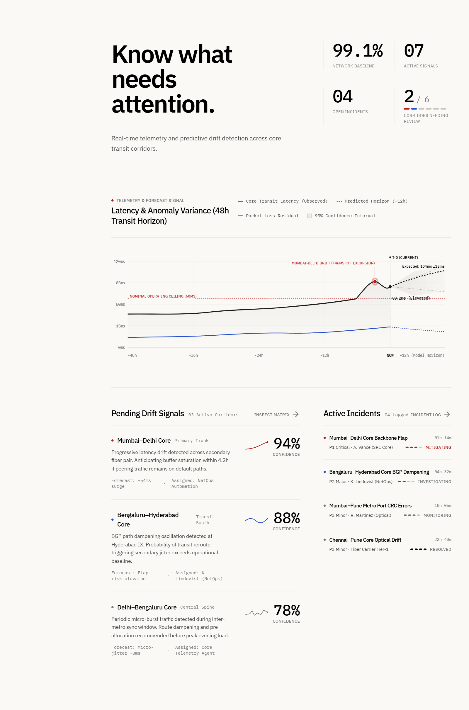
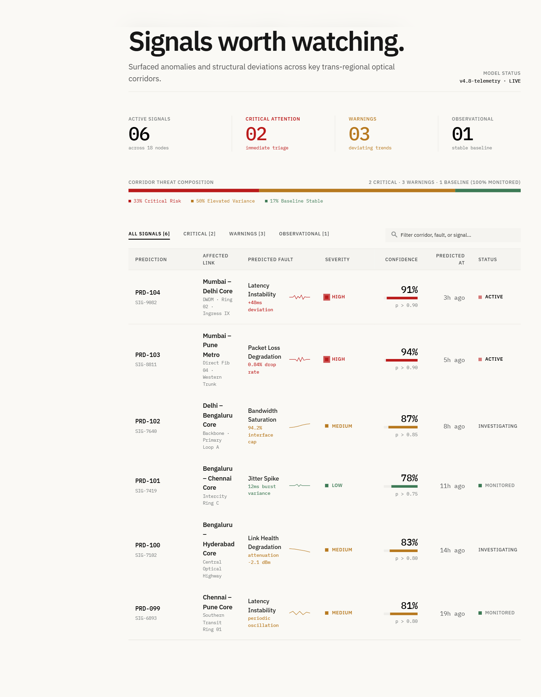
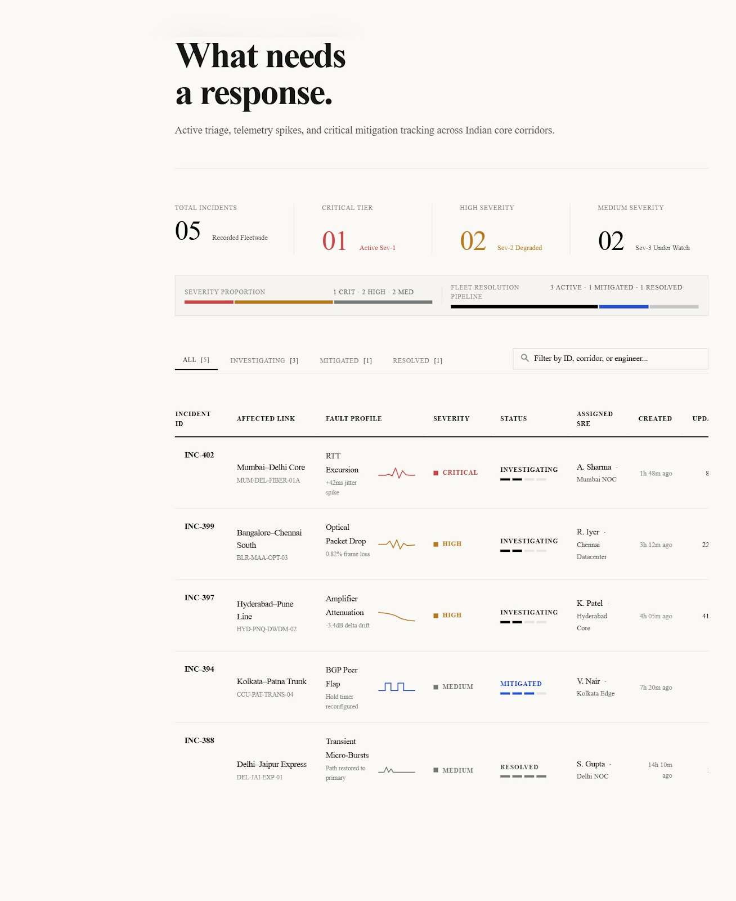
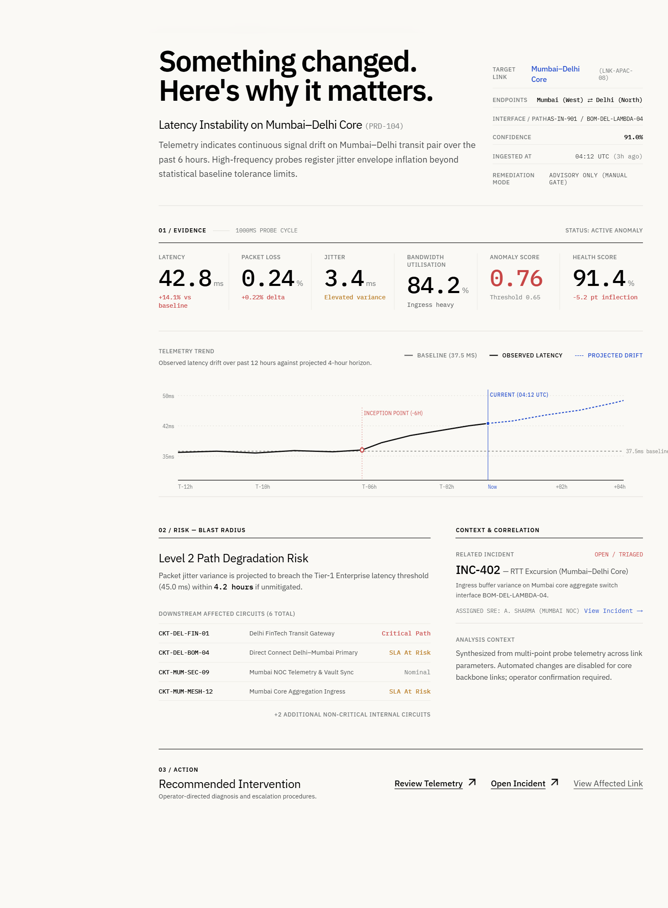

# NetSense AI

Predictive network monitoring and incident investigation — a working product prototype.

NetSense turns raw link telemetry into a workflow an operator can actually act on: it flags which corridors are drifting from baseline, surfaces the predictive signal and evidence behind that flag, links it to any incident it produced, and shows who is investigating it — all in one connected, explorable product instead of a wall of static charts.

Network-operations exposure during my Tata Teleservices internship helped shape the problem framing for this independently built prototype.

**Stack:** Python (rule-based scoring engine, seeded synthetic telemetry, evaluation harness) · React 19 + TypeScript + Vite · Tailwind CSS v4

## Live Demo

**[https://netsense-ai-bclu.vercel.app/](https://netsense-ai-bclu.vercel.app/)**

## Product Truth

This is a portfolio prototype, not a production system. To be specific about what that means:

- Telemetry is synthetic — generated by a seeded, deterministic model, not collected from real hardware.
- Anomaly, health, and risk scoring are rule-based (weighted deviation from a per-link baseline), not a trained ML model.
- It is not connected to a production network and has no real customers.
- There is no autonomous remediation. Every workflow ends at an operator decision point, never an automatic infrastructure change.

## Case Study

The story in the order an AI PM would reason through it — from the user problem, through the workflow, evaluation and failure, to what is and is not established. The supporting documents in [`docs/`](docs/) hold the evidence behind each step; this section is the front door, not a copy of them.

### 1. Real user problem

The user is a **network operations engineer** responsible for a set of live corridors — someone who has to notice abnormal link behavior, judge whether it is a real signal, gather the evidence behind it, and decide who should act. The pain is not "too much data": going from *"something changed"* to *"I know what it is, why it matters, and who owns it"* means assembling context by hand across separate telemetry, alerting and ticketing views, which costs decision confidence as much as time.

Full framing, the product problem statement and the product hypothesis: [`docs/PROBLEM.md`](docs/PROBLEM.md).

### 2. Product insight

The deeper problem is the friction in connecting **signal → evidence → prediction/context → incident → ownership → human decision**. Each normally lives in a different tool. The opportunity is not a better chart; it is removing the seams so an operator reviews them together instead of reassembling them by hand.

> **From fragmented monitoring and investigation, toward a connected detection-to-investigation workflow — where the abnormal signal, its evidence and its incident context can be reviewed together, before a human makes a decision.**

### 3. Before → After

**Before** (a workflow hypothesis informed by general domain exposure, not a reconstruction of any specific employer's process): monitor telemetry and alerts across separate tools, notice an abnormal metric, compare several metrics by hand, look up or create a ticket elsewhere, work out ownership separately.

**After**, mapped to what the product does: Overview → a flagged corridor → its evidence → the prediction behind it → the incident it produced (timeline linked to the telemetry chart) → the assigned engineer → **the operator decides**. Nothing in that path is automated. Any time or effort saved is a hypothesis, not a measurement.

### 4. AI / automation workflow

```
Input → Processing → Detection → Evidence → Context → Human review → Decision
```

Only one part is computed: the seeded synthetic telemetry and the anomaly/health scoring derived from it — a deterministic, weighted-deviation rule, **not machine learning**. The Python engine in [`engine/`](engine/) is the reference implementation and generates the data the app reads; the app's TypeScript scorer is held to it by exact-equality parity tests. Prediction severity, confidence, fault labels, incident narratives and engineer assignment are **authored demonstration content**. The engine's rule-based workflow joins these stages and labels each as computed or authored; it never creates, resolves or assigns anything.

Detail, including the computed/authored/human/future table and why a rule was chosen over ML: [`docs/AI-WORKFLOW.md`](docs/AI-WORKFLOW.md).

### 5. Evaluation

Matched the expected state in **5/5 resolvable cases across 6 telemetry profiles**, with a rule-based anomaly-to-incident workflow (not trained ML). The detector is a hand-written rule, so it is evaluated against designed scenarios rather than scored for accuracy. The expected states were pre-registered in [`docs/PROFILE_SPEC.md`](docs/PROFILE_SPEC.md) before the engine existed; method, results and limitations are in [`docs/EVALUATION.md`](docs/EVALUATION.md), with committed result files in [`docs/results/`](docs/results/).

| Measurement | Result |
|---|---|
| Rule-based detection agreement on 6 designed telemetry profiles | **5/5** resolvable profiles matched their expected state (1 unresolvable profile reported separately) |
| Authored-vs-computed consistency audit (a separate check; never combined with the above) | **10** consistent, **2** flagged, **1** not comparable, across 13 records (7 predictions + 6 incidents) |

The 5/5 is agreement on synthetic scenarios the rule's author designed — a sanity check that the rule does what it was meant to, not accuracy and not evidence about real networks.

**The finding:** a **temporal blind spot** — a healthy score (~0.16) beside an active high-severity incident (INC-395, Bengaluru–Hyderabad Core). Rolling-window scoring is documented as the next step and is **not built**.

### 6. Failure modes

The central, evaluation-found failure is that blind spot: an operator sees a corridor read healthy while an active, high-severity incident sits on the same corridor — a contradiction on the two screens they would check together. Four further failure modes exist structurally (the authored-vs-computed seam, limited signal coverage, missing-telemetry handling, confidence ambiguity). Inventory, prioritisation and reasoning: [`docs/FAILURES-GUARDRAILS.md`](docs/FAILURES-GUARDRAILS.md).

### 7. Guardrails and human control

Verified against the code: no autonomous remediation, no automatic incident creation or resolution, no automatic engineer assignment, deterministic and inspectable scoring, evidence shown beside every claim, and the synthetic nature of the data disclosed. A rerunnable consistency audit, a drift check on generated data and TypeScript/Python parity tests guard against the layers silently diverging. The principle for what is not built: **when evidence is unreliable or conflicting, reduce automation and increase transparency — never let the system decide anyway.** Details: [`docs/FAILURES-GUARDRAILS.md`](docs/FAILURES-GUARDRAILS.md).

### 8. Product decision and tradeoff

After the blind spot surfaced it was **not** cosmetically patched: the synthetic telemetry was not retuned and the formula and `0.22` threshold were not changed in reaction to one case. Either would have made the evaluation look better without proving anything. The failure was kept visible, and rolling-window scoring was documented as the next step. The tradeoff: patching would have made the prototype look more finished while hiding exactly what an evaluation exists to find; preserving it keeps the limitation visible and turns it into a specific, testable next step. That is prioritisation, not an unfinished product.

### 9. Business and user value

**Established in the public record:** a genuinely connected workflow (clickable link ↔ prediction ↔ incident ↔ engineer relationships), 5/5 agreement on the designed scenarios, and human review required everywhere. **Value hypotheses, not measured results:** faster triage, lower investigation friction, less context switching, better use of engineering attention, earlier identification of potentially important issues. No monetary values or percentages are attached to any of them. Value tree and metrics plan: [`docs/VALUE.md`](docs/VALUE.md).

### 10. What the public record does and does not establish

Real-world testing of the prototype was done in a confidential network-operations setting with company data. The underlying data, organization-specific findings and detailed feedback are confidential and are not reproduced here; this repository and the public case study use synthetic telemetry only. The public record therefore contains no user-testing results, and these remain hypotheses publicly: that NetSense reduces investigation time or context switching, that operators prefer the connected workflow, that it improves decision confidence or escalation quality, and that the value justifies the added complexity.

### 11. Next step

Rolling-window / variance-aware scoring is the documented next step and is **not built**. Its value would need its own pre-registered evaluation before anything is claimed. Further user validation would be documented here only to the extent it can be disclosed.

## Product Workflow

```
Telemetry
  → baseline / deviation analysis
    → anomaly signal
      → severity / confidence assessment
        → prediction
          → incident
            → engineer investigation
              → resolution
```

Every step above is a real, linked record in the product: each prediction points back to the corridor it came from, and each incident points to its corridor, its assigned engineer and — for five of the six — the prediction it originated from. (The authored cross-references are not perfectly symmetric: INC-391 names no originating prediction, and PRD-101 and PRD-103 do not link forward to the incidents that name them. `python -m netsense validate-seed` reports these.) Nothing here implies autonomous infrastructure changes — the workflow ends at operator investigation and action, by design.

## Key Product Capabilities

- **Network Overview** — fleet-wide health baseline, active signal count, and a 48-hour latency/anomaly trend for an operator-selectable corridor.
- **Network Links** — sortable, filterable table of all corridors with live health/latency/loss/load/jitter, and at-a-glance indicators for any link with an active prediction or open incident.
- **Predictions & Prediction Detail** — severity, confidence, and projected risk horizon for each signal, with the underlying telemetry evidence (latency, loss, jitter, bandwidth) and a horizon curve that reshapes itself from that prediction's actual confidence and time-to-impact.
- **Incidents & Incident Detail** — full incident timeline cross-referenced to its originating prediction and assigned engineer, with timeline entries that move the telemetry chart's crosshair to the corresponding moment.
- **Engineers** — duty roster filterable by region and specialisation, with each engineer's currently assigned incident.
- **Interactive telemetry charts** — hover/touch/keyboard-driven crosshair and tooltip, baseline and threshold overlays, projected-horizon shading.
- **Linked relationships everywhere** — link ↔ prediction ↔ incident ↔ engineer references are real, clickable navigation, not decorative text.
- **Responsive, keyboard-accessible UI** — validated from 375px mobile through 1440px desktop, with keyboard equivalents for every interactive element (sort, filter, chart inspection, evidence/corridor selection).

## Product Thinking

- **Investigation-first, not dashboard-first.** The product is built around following a signal to its evidence and its owner, not just displaying numbers.
- **Evidence before conclusion.** A prediction's confidence is never shown without the telemetry that produced it being one click away.
- **Relationships as a first-class concept.** Link, prediction, incident, and engineer are never siloed screens — every one links to the others because that's how an operator actually thinks about an incident.
- **Progressive disclosure.** List views stay dense and scannable; detail views expand into full evidence and context on demand.
- **Reusable detail patterns over one-off screens.** Engineer Detail wasn't part of the original design source — it's assembled entirely from primitives already established elsewhere in the product (hairline stat rows, editorial captions), so a new route didn't mean a new visual language.
- **Operator control, not simulated autonomy.** The product surfaces evidence and recommends nothing it can't back up; it never pretends to take action on its own.

## Detection Approach

Detection is deterministic and fully inspectable — there is no black box. The reference implementation is the Python engine in [`engine/`](engine/) (`engine/netsense/scoring.py`); the app's TypeScript scorer (`app/src/lib/derive.ts`) is held to identical results by parity tests.

For each link, current telemetry is compared against that link's own baseline:

1. **Deviation terms** are computed for latency, packet loss, jitter, and bandwidth utilisation, each normalised to its own "notable excursion" scale and capped at 1 (so a metric with a near-zero baseline, like packet loss, doesn't blow up the score).
2. A **weighted composite anomaly score** (latency 40%, loss 30%, jitter 15%, bandwidth 15%) combines those terms into a single 0–1 figure.
3. A link is flagged for **attention** once its anomaly score reaches a shared threshold (`0.22`) — one constant, used everywhere that verdict is shown. (A corridor's *display* status is the worse of that live state and any authored high/critical record on it, so an authored incident can keep a corridor flagged while its live score is healthy — see [`docs/EVALUATION.md`](docs/EVALUATION.md).)
4. A **health score** (100 − anomaly score × 38, floored at 55) gives the same information as a single top-line percentage.

The scorer looks at **one instant** — the latest sample — and has no memory of earlier ones.

Predictions and incidents are **authored demonstration content** — severity, confidence, fault labels, narrative, and engineer assignment are fixed dataset records representing what a rule engine might surface, not live model output. What *is* computed live from each record's real fields: the risk-horizon curve on Prediction Detail reshapes its inflection point from that prediction's actual `horizonHours` and `confidencePct`, and every cross-reference between a link, prediction, incident, and engineer is resolved from the same shared dataset at render time. How closely the authored layer agrees with the computed one is measured, not assumed — see [`docs/EVALUATION.md`](docs/EVALUATION.md).

The engine's rule-based workflow (`engine/netsense/workflow.py`) joins these stages and labels each as computed or authored:

```
signal (computed) → severity/confidence (authored) → prediction (authored) → linked incident (authored) → engineer context (authored assignment)
```

It reads and links records; it never creates, resolves or reassigns anything.


## How to reproduce

```bash
# Python engine and evaluation (standard library only; pytest for tests)
cd engine
python -m venv .venv
.venv/Scripts/python -m pip install -e ".[dev]"    # Windows; on macOS/Linux use .venv/bin/python
.venv/Scripts/python -m netsense evaluate          # prints the results and rewrites docs/results/*.json
.venv/Scripts/python -m netsense check             # fails if the app's generated data or the results drifted
.venv/Scripts/python -m pytest                     # unit, evaluation, spec and TypeScript-parity tests
.venv/Scripts/python -m netsense build-data        # regenerate app/src/data/generated/

# App (parity tests need `npm install` here; the app itself needs no Python at build time)
cd ../app
npm install
npm run dev
npm run typecheck && npm run lint && npm run build
```

## Technical Architecture

- **Python engine (`engine/`)** — standard library only; **pytest** for tests. Seeded synthetic-telemetry generator, the rule-based scorer, the anomaly-to-incident workflow, and the evaluation harness. It is the source of truth for the app's data: it validates the authored seed (`engine/seed/`), generates the telemetry, and writes the JSON the app imports (`app/src/data/generated/`, committed, so the app's build needs no Python).
- **React 19 + TypeScript + Vite**, **React Router 7** for client-side routing, **Tailwind CSS v4** (via `@tailwindcss/vite`) for styling.
- **`src/data/`** — thin typed modules over the generated JSON: 6 India network corridors, 7 predictions, 6 incidents, 10 engineers, and seeded 30-minute telemetry (`t = -48h … +12h`) per link.
- **`src/lib/derive.ts`** — the anomaly/health scoring described above (TypeScript; held to the Python engine by exact-equality parity tests).
- **`src/lib/aggregate.ts`** — cross-references links, predictions, incidents, and engineers so every screen agrees.
- **`src/components/charts/`** — reusable SVG chart primitives (`TelemetryTrendChart`, `Sparkline`, `HealthRing`, `RiskHorizonMini`, `RouteTopology`), all driven by real data arrays and scaled via `viewBox` rather than fixed pixel sizes.
- **`src/components/motion/`** — small, shared motion primitives (count-up, animated bar/path, fade-in) that respect `prefers-reduced-motion` globally.
- **`src/pages/`** — the routed screens listed above.

The dataset, scoring, and chart layers are separated from the page components, and the pages consume computed vitals through a stable shape rather than raw telemetry math inline — so the detection logic could later be replaced by a backend or a different method without rewriting the screens. That is a structural property of the code, not something that has been done or tested.

## Repository Structure

```
app/                                  the actual product (deploys to Vercel)
  src/
    components/
      charts/                        TelemetryTrendChart, Sparkline, HealthRing, RiskHorizonMini, RouteTopology
      motion/                        CountUp, AnimatedBar, AnimatedPath, FadeIn, HoverTip, TooltipCard
      layout/                        AppShell (sidebar + header)
      ui/                            SortArrow, StatusTag
    data/                            typed modules over generated/ (links, predictions, incidents, engineers, telemetry JSON from the engine)
    lib/                             derive (scoring), aggregate (cross-references), sort, format, motion, status
    pages/                           Overview, NetworkLinks(+Detail), Predictions(+Detail), Incidents(+Detail), Engineers(+Detail)
  scripts/                           parity helpers + the legacy TypeScript generator (reference only)
  public/
  package.json
  vercel.json                        SPA rewrite so deep links resolve on Vercel

engine/                               the Python engine (source of truth for the app's data)
  netsense/                          telemetry, scoring, profiles, workflow, evaluation, dataset, cli
  seed/                              authored demonstration content (links, predictions, incidents, engineers)
  tests/                             pytest suite, incl. TypeScript parity

docs/
  PROBLEM.md                         user, pain, hypothesis, before/after
  AI-WORKFLOW.md                     computed vs authored vs human vs future
  PROFILE_SPEC.md                    pre-registered profiles and expected states
  EVALUATION.md                      method, results, limitations
  FAILURES-GUARDRAILS.md             failure modes, guardrails, fallbacks, decisions
  VALUE.md                           value hypotheses, metrics plan
  results/                           committed JSON results

stitch_netsense_ai_design_system/     the approved Stitch design source
  netsense_ai/DESIGN.md               design tokens, brand & style rationale
  overview/ network_links/ link_detail/
  predictions/ prediction_detail/
  incidents/ incident_detail/
  engineers/                          each with the original code.html + screen.png
```

The Stitch export is the frozen visual source of truth; `app/` is the working implementation of it, wired to real (synthetic) data.

## Screens

The screens below are the approved Stitch designs, which the live implementation follows pixel-for-pixel — open the [live demo](https://netsense-ai-bclu.vercel.app/) for the interactive product.

**Overview** — fleet health, active signals, and the 48-hour telemetry trend for the selected corridor.


**Predictions** — every active signal with severity, confidence, and threat composition.


**Incidents** — the operational incident log with severity, status, and resolution pipeline.


**Prediction Detail** — telemetry evidence, projected risk horizon, and related incident context for a single signal.


## Local Development

```bash
cd app
npm install
npm run dev        # http://localhost:5173
```

```bash
npm run typecheck  # tsc -b --noEmit
npm run lint        # oxlint
npm run build        # tsc -b && vite build
```

The Python engine and evaluation commands are under [How to reproduce](#how-to-reproduce).

## Validation

As of the current commit:

- `npm run typecheck`, `npm run lint`, and `npm run build` all pass cleanly.
- The pytest suite in `engine/` passes, including exact-equality parity checks between the Python engine and the app's TypeScript scorer, and a check that the committed generated data and results match what the engine produces.
- When the app was switched to read engine-generated data, every route was screenshotted before and after at 375px and 1440px and the images were pixel-identical.
- Manually verified responsive behaviour at 375 / 390 / 768 / 1024 / 1280 / 1440px with no horizontal overflow, and no console errors across the core screens.
- There is no automated browser/UI test suite; UI checks are manual and screenshot-based.

## Limitations / Disclosure

This is a portfolio prototype using synthetic, generated telemetry. The detection and risk logic is deterministic and rule-based rather than a trained ML model. It is not connected to a production network, has no real customers, and performs no autonomous remediation — every workflow surfaces evidence for a human operator to act on.

Evaluation-specific limits (detail in [`docs/EVALUATION.md`](docs/EVALUATION.md)): the test scenarios were designed by the rule's author, so agreement is partly by construction; five resolvable scenarios is a sanity check, not a performance claim; the detector scores a single instant and misses the designed intermittent-instability case; and prediction severity, confidence, fault labels, incidents and engineer assignment are authored demonstration content, not outputs of the detector.

## Future Direction

Realistic next steps, not current functionality:

- **Rolling-window / variance-aware scoring** — documented as the next step after the oscillation finding; **not built**, and its value would need its own pre-registered evaluation.
- Ingesting real telemetry from production or lab network equipment.
- A real backend/API layer instead of an in-browser generated dataset.
- Replacing the rule-based scoring with a trained anomaly-detection model.
- Authenticated, per-operator workflows (assignment, acknowledgement, audit trail).
- Integration with real alerting/paging tools (e.g. PagerDuty, Slack).

## Project Context

Network-operations exposure during my Tata Teleservices internship helped shape the problem framing for this independently built prototype, which explores how predictive network telemetry could be made explorable and actionable for network operators.
